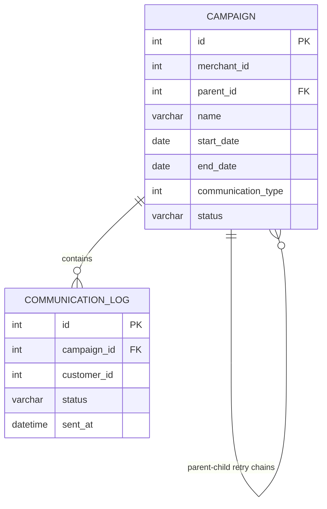

# Comm-Log Send Reconciliation — Merchant 501, Diwali Campaigns, October 2026

## Summary

Finance reports `target_base = 22` qualifying sends for merchant 501 during October 2026 Diwali campaigns. A naive count of communication log rows yields 30 sends. Two real adjustments close the gap: (1) excluding sends from campaign 9004, which is still `approval_awaiting` and not reportable, and (2) excluding soft-failure rows (`delivery_status = 1100`) that were retried elsewhere. The final query in `sql/reconciliation_query.sql` reproduces 22 using a recursive CTE for retry-chain-aware deduplication.

**Verify independently:** Run `python scripts/verify_reconciliation.py` to see the full reconciliation bridge and confirm the number is correct.

## Problem

For merchant 501 in October 2026, how many qualifying sends occurred under Diwali campaigns (`communication_type = '2'`), after applying eligibility filters and correctly handling retry chains?

## Data

The project includes two raw CSV files and one SQLite database:

- **`data/campaign.csv`** — Campaign metadata: `id`, `merchant_id`, `parent_id` (for retry chains), `name`, `creation_status`, `processing_status`.
- **`data/communication_log.csv`** — One row per send attempt: `id`, `merchant_id`, `communication_id` (links to campaign), `customer_id`, `communication_type` (2 = Diwali), `delivery_status` (900 = success, 1100 = soft failure), `sent_time`.
- **`data/comm_log.db`** — SQLite database containing the above tables for querying.

### Entity-Relationship Diagram



## Investigation Process

We began with the most obvious query and refined it step by step:

1. **Naive scoped count** — All rows for merchant 501, `communication_type='2'`, October 2026 → **30** sends.
2. **Add campaign eligibility** — Join to `campaign` and keep only finalized campaigns (`creation_status` in `approved`, `aborted`, `resumed`, `stopped`). Drops **4** rows from campaign 9004 (`approval_awaiting`): **26** sends.
3. **Add delivery success** — Keep only `delivery_status = 900`. Drops **4** soft-failure rows (C2 and C3 in 9001/9002, D1 in 9201): **22** sends. Matches Finance's number.
4. **Check for over-counting** — A global `COUNT(DISTINCT customer_id)` yields 21, which is incorrect: it merges two separate standalone sends to customer C20 (campaign 9101, Oct 10 and Oct 20). The correct rule is to deduplicate only within a retry chain, not across the merchant.
5. **Validate retry chains** — No customer received more than one successful delivery within the same retry chain in this dataset, so the row-count and chain-aware queries agree. The chain-aware query is the correct generalization.

## Reconciliation Bridge

| Step | Description | Result | Reason |
|------|-------------|--------|--------|
| 0 | Naive `COUNT(*)`, scoped to merchant 501 / Oct 2026 / `communication_type='2'` | 30 | Baseline scoped to merchant 501, October 2026, and communication type `2`. |
| 1 | Join to `campaign`, keep only finalized campaigns | 26 | Campaign 9004 (`approval_awaiting`) is not reportable. Dropped 4 rows (C11–C14). |
| 2 | Keep only `delivery_status = 900` | 22 | Four soft failures (`delivery_status = 1100`) dropped. Matches Finance. |
| Trap | Global `COUNT(DISTINCT customer_id)` | 21 | Incorrectly merges C20's two standalone sends under campaign 9101. |

## Final SQL

The query is at `sql/reconciliation_query.sql`. It uses a recursive CTE to traverse retry chains:

- **Retry chains (2+ campaigns):** counts one qualifying send per distinct customer per chain.
- **Standalone campaigns (1 campaign):** counts every delivered send individually.

This handles duplicate customers across different chains and avoids over-counting retries within a chain. No hardcoding — the result is derived from the data.

## Surprising Observations

- Campaign 9004 had fully delivered messages despite never clearing approval. The log alone cannot tell you a send is disqualified; you must check the campaign lifecycle state.
- The `communication_type = '2'` filter was redundant in this dataset (every campaign for merchant 501 is Diwali-themed), but is retained for correctness in a real-world query.
- The row-count and chain-aware queries agree only because no customer was delivered twice within the same retry chain. The chain-aware query is retained as the correct generalization.

## How to Run

**Final query:**
```bash
sqlite3 data/comm_log.db < sql/reconciliation_query.sql
```

**Verification script (prints the full bridge and confirms 22):**
```bash
python scripts/verify_reconciliation.py
```

## Repository Structure

```
.
├── README.md
├── .gitignore
├── data/
│   ├── campaign.csv          # Campaign metadata
│   ├── communication_log.csv # Raw communication log
│   └── comm_log.db           # SQLite database
├── sql/
│   └── reconciliation_query.sql  # Final chain-aware query
└── scripts/
    └── verify_reconciliation.py  # Verification script
```
