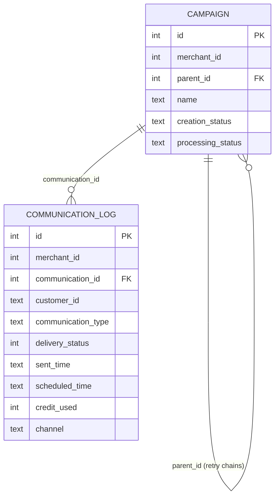

# Xeno Data Analyst Assignment

## Final Answer

`target_base = 22`

## Reconciliation Bridge

30 → 26 → 22

## Key Finding

`COUNT(DISTINCT customer_id)` gives 21, not 22, because customer C20 has two delivered sends under standalone campaign 9101 — both count individually, but a global DISTINCT collapses them.

---

## Full Analysis

Finance reports `target_base = 22` qualifying sends for merchant 501 during October 2026 Diwali campaigns. A naive count of the communication log is 30 sends. Two adjustments bring it to 22: (1) excluding 4 sends from campaign 9004, which is still `approval_awaiting` and not reportable, and (2) excluding 4 soft-failure rows (`delivery_status = 1100`), each of which was retried and delivered within its own chain. The query at `sql/reconciliation_query.sql` gets 22 using a recursive CTE that deduplicates per chain, not globally.

Run `python scripts/verify_reconciliation.py` to confirm everything independently.

## Problem

For merchant 501 in October 2026, how many qualifying sends occurred under Diwali campaigns (`communication_type = '2'`), after applying campaign eligibility filters and correctly handling retry chains?

## Data

- **`data/campaign.csv`** — Campaign metadata (7 rows): `id`, `merchant_id`, `parent_id` (NULL at the root of a retry chain), `name`, `creation_status`, `processing_status`.
- **`data/communication_log.csv`** — One row per send attempt (30 rows): `id`, `merchant_id`, `communication_id` (links to campaign), `customer_id`, `communication_type` (2 = Diwali), `delivery_status` (900 = delivered, 1100 = soft failure), `sent_time`, `scheduled_time`, `credit_used`, `channel`.
- **`data/comm_log.db`** — SQLite database containing both tables.

### Schema (source of truth: `data/comm_log.db`)

| Table | Column | Type | Notes |
|-------|--------|------|-------|
| `campaign` | `id` | INTEGER | **Primary key** |
| `campaign` | `merchant_id` | INTEGER | NOT NULL |
| `campaign` | `parent_id` | INTEGER | Logical FK → `campaign.id`; NULL for root campaigns |
| `campaign` | `name` | TEXT | NOT NULL |
| `campaign` | `creation_status` | TEXT | NOT NULL — observed: `approved`, `approval_awaiting` |
| `campaign` | `processing_status` | TEXT | NOT NULL — observed: `processed` |
| `communication_log` | `id` | INTEGER | **Primary key** |
| `communication_log` | `merchant_id` | INTEGER | NOT NULL |
| `communication_log` | `communication_id` | INTEGER | NOT NULL; logical FK → `campaign.id` |
| `communication_log` | `customer_id` | TEXT | NOT NULL |
| `communication_log` | `communication_type` | TEXT | NOT NULL — `'2'` = Diwali |
| `communication_log` | `delivery_status` | INTEGER | NOT NULL — 900 = delivered, 1100 = soft failure |
| `communication_log` | `sent_time` | TEXT | NOT NULL |
| `communication_log` | `scheduled_time` | TEXT | NOT NULL |
| `communication_log` | `credit_used` | INTEGER | NOT NULL |
| `communication_log` | `channel` | TEXT | NOT NULL |

The SQLite schema doesn't enforce foreign keys — the two logical FKs above are validated by `scripts/verify_reconciliation.py`.

### Entity-Relationship Diagram



### Retry chains in the data

- **Chain rooted at 9001**: `9001 → 9002 → 9003`, plus `9004` (child of 9001, `approval_awaiting`, excluded from results).
- **9101**: standalone campaign (no retries).
- **Chain rooted at 9201**: `9201 → 9202`.

## Reconciliation Bridge

| # | Step | Previous | Adjustment | New result | Evidence |
|---|------|----------|------------|------------|----------|
| 1 | Naive scoped count: all `communication_log` rows for merchant 501, Oct 2026, `communication_type = '2'` | — | — | **30** | Every send attempt in scope. |
| 2 | Keep only reportable campaigns | 30 | −4 (send IDs 14–17, C11–C14) | **26** | Campaign 9004 is `approval_awaiting` — not reportable even though all 4 were delivered. |
| 3 | Keep only delivered sends (`delivery_status = 900`) | 26 | −4 (send IDs 2, 4, 5, 25) | **22** | Soft failures: C2@9001, C3@9001, C3@9002, D1@9201. Each was retried and delivered within its chain. |
| 4 | Retry-chain-aware deduplication | 22 | ±0 | **22** ✅ | Chain 9001 → 10 (C1–C10), chain 9201 → 5 (D1–D5), standalone 9101 → 7. Total = 22. |

### Why `COUNT(DISTINCT customer_id)` gives 21, not 22

Running `COUNT(DISTINCT customer_id)` on the 22 delivered sends gives **21**. Customer **C20** received two delivered sends under **standalone** campaign 9101 (send IDs 18 and 19 — Oct 10 and Oct 20). Global `DISTINCT` counts C20 once, but standalone campaigns count each delivered send individually. The correct deduplication is per retry chain, not per merchant.

## Business Rule Justification

The eligibility filter uses `creation_status IN ('approved', 'aborted', 'resumed', 'stopped') AND processing_status = 'processed'`. This is an interpretation of the assignment's intent, not a rule the data itself proves.

A campaign in `approval_awaiting` never cleared review — its sends shouldn't count toward Finance's number. The remaining statuses represent campaigns that reached a finalized state in their lifecycle (approved, aborted after starting, resumed, or stopped mid-run), all with sends that were actually processed. We can't derive this purely by trial and error to match 22; if we included `approval_awaiting`, the count would be 26, which disagrees with Finance. The filter is therefore a principled reading of the data dictionary's intent, cross-checked against the expected result.

## Final SQL

The query at `sql/reconciliation_query.sql` uses a recursive CTE to walk retry chains:

- **Retry chains (2+ campaigns):** one qualifying send per distinct customer per chain.
- **Standalone campaigns (1 campaign):** every delivered send counts individually (the C20 case above).

The query only hardcodes the scope filters (merchant 501, October 2026, type `'2'`). Everything else is derived from the data.

## Observations

- **Campaign 9004 sent and delivered while unapproved.** All 4 sends have `delivery_status = 900` and `processing_status = 'processed'`, but `creation_status = 'approval_awaiting'`. You have to check campaign status to know a send is disqualified — the log alone won't tell you.
- **Every soft failure was retried successfully.** The 4 `delivery_status = 1100` rows (C2@9001, C3@9001, C3@9002, D1@9201) each have a later delivered retry in the same chain.
- **The scope filters don't change anything here.** All 30 rows are merchant 501, type `'2'`, inside October 2026, and `sent_time = scheduled_time` for every row. They're kept because the assignment defines the scope.

## How to Run

```bash
python scripts/verify_reconciliation.py
```

Or directly with `sqlite3`:

```bash
sqlite3 data/comm_log.db < sql/reconciliation_query.sql
```

## Repository Structure

```
.
├── README.md
├── .gitignore
├── data/
│   ├── campaign.csv
│   ├── communication_log.csv
│   └── comm_log.db
├── sql/
│   └── reconciliation_query.sql
└── scripts/
    └── verify_reconciliation.py
```
